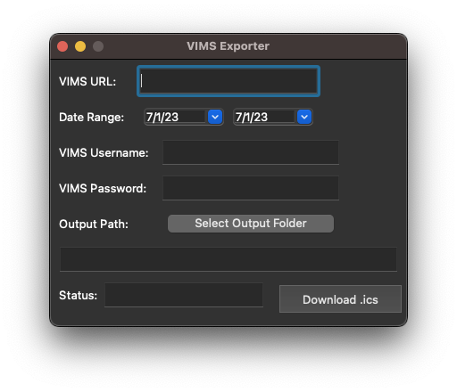

# VIMS to .ics Exporter

## [Download Links](https://github.com/tsnowak/vims_exporter/releases/tag/release)

---

## Overview

This tool automatically exports events from a [Volunteering Integrated Management System (VIMS)](http://www.publicsafetysg.com/vims) calendar into a `.ics` file so that they can be imported into any modern calendar tool or shared as a file.

## Background

The [Volunteering Integrated Management System (VIMS)](http://www.publicsafetysg.com/vims) is used by public service agencies to track volunteer hours, trainings, and events for their teams. However, VIMS is not modernized to say the least. While it has an integrated calendar, there is no way to export that calendar to modern calendar tools - such as iCal, Google Calendar, or others. That's where this tool comes in.

## Usage

To use this program:

1. [Download the "binaries" for your operating system](https://github.com/tsnowak/vims_exporter/releases/tag/release)
2. Unzip the package
3. Open the `dist` folder, and double click the executable file:

- Windows: `vims_to_ics.exe`
- MacOS: `vims_to_ics.app`
- Linux: `vims_to_ics`

4. Your computer will say it's not from a trusted publisher. Open it anyways.
5. A GUI should appear once you've lanuched the program. Enter in:

- The VIMs URL for your team
- The date range of events you want to export
- Your VIMS username and password
- And select an output folder on your computer at which to save the `vims_cal.ics` file

6. Then click run! It will take a moment to perform magic in the background, but if you see "Success!" in the status pane, the `vims_cal.ics` file should be in your selected output file path.
